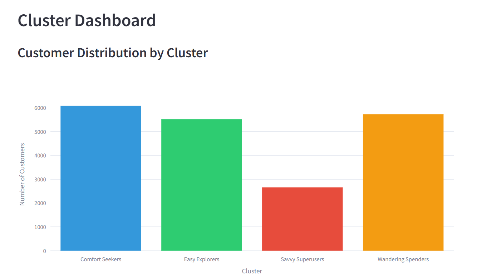
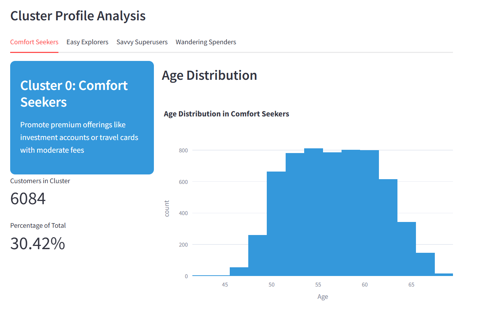

# Running `app.py` with docker
This section contains instructions on how to run `app.py` with docker.

## Prerequisites
- Ensure you have Docker installed on your local machine. You can download and install Docker from https://www.docker.com/products/docker-desktop/.
- The dashboard uses Python 3.9 as specified in the Dockerfile.
- Ensure that your terminal's directory is in the API folder.
- Download all the files in this folder and ensure they are placed in the same directory on your system.

## Build and Run Instructions

1. Ensure Docker is running and run the commmand to build the Docker image :

   ```bash
   docker build -t segmentation_dashboard .
   ```
   
2. Run the Docker image :

   ```bash
   docker run -p 5000:5000 -p 8501:8501 segmentation_dashboard
   ```
   
3. The application will be accessible at http://localhost:8501/

## Functions of the dashboard

### 🧠  Real-Time Customer Segmentation API
A Streamlit-powered dashboard and API for real-time customer segmentation using machine learning. This tool empowers marketing, analytics, and customer experience teams to understand customer clusters, analyze behavior, and predict segment membership based on user profile inputs.

### 📌 Features/Functions

- Cluster Information
  - View overall distribution and insights for each customer segment.

- Fetch Customer
  - Retrieve customer data and the cluster they've been assigned to using their Customer ID.

- Predict Cluster
  - Input a new customer’s profile to categorize them into a cluster instantly using the trained model.

### 📊 Cluster Dashboard/Information

Get an overview of your customer distribution across different behavioral and demographic clusters:

1. Comfort Seekers

2. Easy Explorers

3. Savvy Superusers

4. Wandering Spenders




Each cluster provides insight into key traits and group behavior.



### 🔍 Fetch Customer by ID

Input a customer’s unique ID to view:

Demographic & profile details

Their assigned cluster

Strategic recommendations based on cluster behavior (e.g., engagement methods)


### 🤖 Predict Customer Cluster

Enter customer demographic, financial, transaction, and digital engagement data to:

Predict which customer cluster the individual is most likely to belong to.

Tailor offerings and engagement strategies accordingly.


