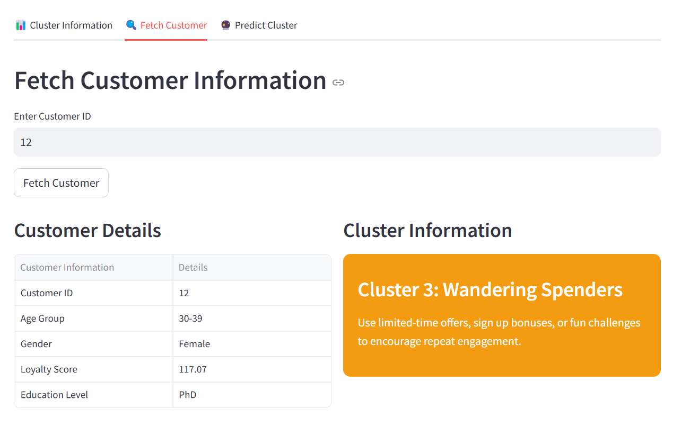

# Running app.py
## This section contains instructions on how to run app.py

1.&nbsp; Ensure that your Python version is at least 3.10. You can check your Python version by running:

```
python --version
```

2.&nbsp; Install the required libraries if you have not done so. You can do so by running the following command:

```
pip install streamlit pandas numpy matplotlib scikit-learn fastapi pydantic uvicorn seaborn plotly
```

3.&nbsp; Download all the files in this folder and ensure they are placed in the same directory on your system.

4.&nbsp; Open the Project in Your IDE

Open your favourite IDE (e.g Visual Studio Code, PyCharm, or any other editor) and navigate to the folder where ```app.py``` and the other required files are located. This will allow you to view, modify and execute the app from within your IDE.

5.&nbsp; Run the Streamlit App

Navigate to the directory containing app.py. You can do this using the cd command. For example,

```
cd path/to/your-folder
```

Once you're in the correct directory, open a new terminal within your IDE or a standalone terminal and run the following command:

```
streamlit run app.py
```

6.&nbsp; Optional Email Prompt

If you are prompted to enter your email address, simply press Enter to skip this step.

7.&nbsp; Open the App in Your Browser

After running the command, the app will launch and you will be automatically redirected to the application in your default web browser. If this does not happen, open your browser and go to the following URL specified by the terminal.


## Functions of API

### 🧠  Real-Time Customer Segmentation API
A Streamlit-powered dashboard and API for real-time customer segmentation using machine learning. This tool empowers marketing, analytics, and customer experience teams to understand customer clusters, analyze behavior, and predict segment membership based on user profile inputs.

### 📌 Features/Functions

- Cluster Information
  - View overall distribution and insights for each customer segment.

- Fetch Customer
  - Retrieve customer data and the cluster they've been assigned to using their Customer ID.

- Predict Cluster
  - Input a new customer’s profile to categorize them into a cluster instantly using the trained model.

### 📊 Cluster Dashboard/Information

Get an overview of your customer distribution across different behavioral and demographic clusters:

1. Comfort Seekers

2. Easy Explorers

3. Savvy Superusers

4. Wandering Spenders


Each cluster provides insight into key traits and group behavior.


### 🔍 Fetch Customer by ID

Input a customer’s unique ID to view:

Demographic & profile details

Their assigned cluster

Strategic recommendations based on cluster behavior (e.g., engagement methods)



### 🤖 Predict Customer Cluster

Enter customer demographic, financial, transaction, and digital engagement data to:

Predict which customer cluster the individual is most likely to belong to.

Tailor offerings and engagement strategies accordingly.


