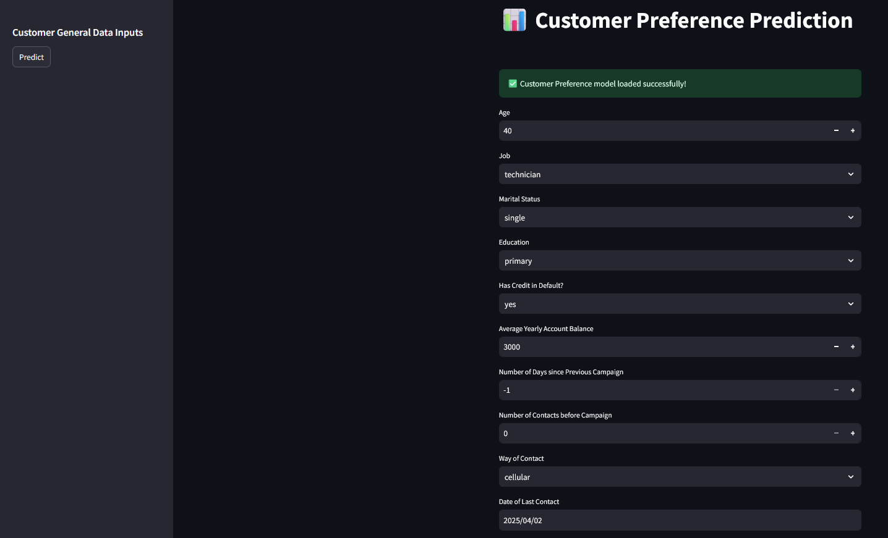
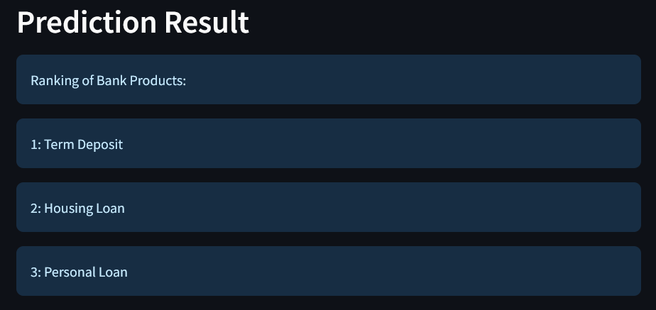
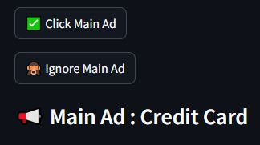
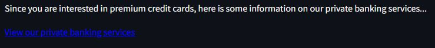
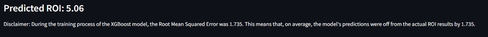

# Running the Dashboard with Docker

## Prerequisites

- Ensure you have Docker installed on your local machine. You can download and install Docker from https://www.docker.com/products/docker-desktop/.
- The dashboard uses Python 3.10 as specified in the Dockerfile.

## Build and Run Instructions
1. Navigate to the dashboard directory
   ```bash
   cd DSA3101-Group-Project/Dashboard
   ```
2. Build the Docker image :

   ```bash
   docker build -t my-streamlit-app .
   ```
3. Run the Docker image :

   ```bash
   docker run -p 8501:8501 my-streamlit-app
   ```
4. The application will be accessible at `http://localhost:8501`.

## Configuration

- The application exposes port `8501` as defined in the Docker Compose file.
- No additional environment variables are required for this setup.

## Notes

- The `default of credit card clients.xls` file is included in the project directory for data processing.

For further details, refer to the project documentation or contact the development team.

# Usage guide
## Home page

When you first open the dashboard, you will be greeted with a selection prompt. From the dropdown menu, choose the function you'd like to use. This will allow you to navigate to the corresponding feature and begin your analysis.

<p align="center">
  
</p>

## Function: Customer Preference Prediction
This function uses a trained ensemble of gradient boosting models to predicts the customer preference on bank products. Enter the customer's details and click 'Predict'
<p align="center">
  
</p>

Then, the rankings of the customer's preference of bank products will be shown in a descending order with the 1st bank product as the most preferred product.
<p align="center">
  
</p>

## Function: CTR-Based 'Real-Time' Campaign Optimizer
This function simulates the optimising of different marketing campaigns, where the volume and type of ads presented to the customer is personalised to his/her behavior in terms of how much the customer engages with the ads. The engagement metric used here is Click Through Rate (CTR), and we assume that the higher the CTR, the higher the engagement and interest, and hence we send a higher volume of similar ads to the customer. 

The main ad being advertised here is a credit card, with the supplementary ads being a premium credit card, and a loan. A customer can choose whether to either click or ignore the ad. Once the CTR of the main ad exceeds 40% , we start sending supplementary ads advertising premium credit card to try and upsell the customer, as the customer shows high engagement. Once the CTR of the main ad reaches 60%, we start sending ads regarding loans to the customer. If the CTR drops below the thresholds (i.e. customer ignores ads enough times to drive down the CTR), the supplementary ads disappear at their respective thresholds.
<p align="center">
  
</p>

Similarly, for the supplementary ads, if the CTR on these ads exceed 40%, an additional link will show up, which are offers on similar products. The additional links will also disappear when the CTR drops below 40% on the supplementary ads.
<p align="center">
  
</p>

## Function: Marketing Campaign ROI Prediction
This function utilises a trained XGBoost model and it predicts the resulting Return on Investment (ROI) for each marketing campaign. The user is able to input values for metrics like Click-Through Rate, and Conversion Rate, which will return a prediction of the ROI.

1. The function's page prompts for data input for most of the metrics as stated in the page. It is reccommended to not leave any blanks.
2. ROI will be predicted after submitting the input.
3. Disclaimer: During the training process of the XGBoost model, the Root Mean Squared Error was 1.735. This means that, on average, the model's predictions were off from the actual ROI results by 1.735.
<p align="center">
  
</p>

## Function: Customer Churn Prediction
This function predicts whether a specific customer is likely to churn in the future. It utilizes two distinct models to generate accurate predictions:

1. Customer general data
   - Use this model if you have access to the customer's basic bank information, enter the required details and click 'Predict' to determine the likelihood of the customer churning.
<p align="center">
  
</p>
2. Customer credit card data.
   - Use this model if you have the customer's credit card payment information, enter the details and click 'Predict' to find out the likelihood of customer churn.
<p align="center">
  
</p>

Once the data is entered and the 'Predict' button is clicked, the model will display whether the customer is likely to churn or not.
<p align="center">
  
</p>


