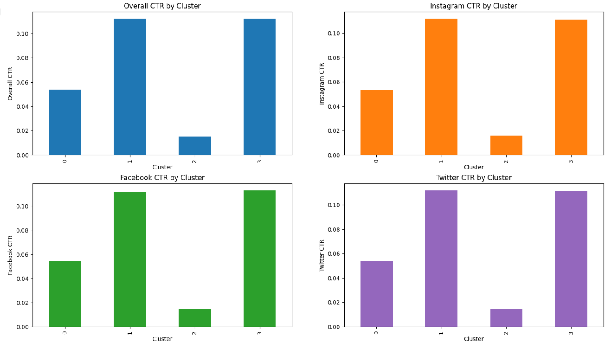
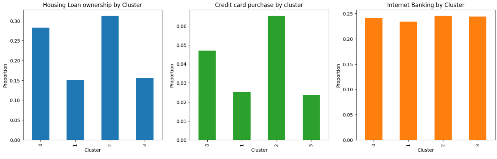
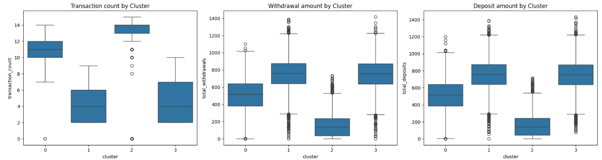

# Customer behavior analysis
This project analyzes customer behavior across different segments to help banks develop more informed and data-driven marketing strategies. The goal is to help financial institutions deliver more targeted and effective marketing strategies.

---

File 1: behavioral_patterns_code.py

- Contains the code for analysis patterns and plotting graphs

File 2: final_segmentation_model.py

- Contains the K-means model and the clusters used in this analysis

Folder 1: Images
- Contains transaction_count.png , digital_engagement.png and 
product_usage.png for visualisation purposes in this README file

## Key Insights 

### Findings (Digital Engagement)

#### Mean CTR across all campaign ads

- The bar chart "Overall CTR by Cluster" displays the average click-through rate (CTR) for each of four customer clusters (Cluster 0 to Cluster 3). These are the findings:

  - Cluster 1 and Cluster 3 exhibit the highest average CTR, both exceeding 0.11.

  - Cluster 0 has a moderate CTR, around 0.053.

  - Cluster 2 has the lowest CTR, approximately 0.015.

 - This suggests that customers in Cluster 1 and Cluster 3 are much more responsive to marketing campaigns compared to those in Clusters 0 and 2, with cluster 0 being moderately receptive.
   - Cluster 1 (High CTR):  They're likely more impulsive or open to promotions, making them more responsive to marketing messages even if they don’t engage in transactions often.

   - Cluster 0 (Moderate CTR):  It could be that they use the service often but may ignore ads unless there's a strong financial incentive , hence moderate CTR.

   - Cluster 3 (High CTR):  It could be that they are shopping around, so well-targeted offers can grab their attention, leading to higher CTR.

   - Cluster 2 (Low CTR):  They are already engaged and content so they may be less likely to click on new promotions, leading to lower CTR.

#### CTR profile between different campaigns

 - Note that between Facebook, Instagram and Twitter ads, for each of the specific platforms, the CTR profile of the different clusters remain the same as the overall CTR across all platforms.
 - The consistency in CTR patterns across platforms suggests that customer engagement is driven more by inherent user traits (e.g., income, age) than by the platform itself.

### Findings (Product Usage)

#### Similar internet banking usage across clusters

- This finding suggests that digital penetration is uniform across all customer types, regardless of income, loyalty, or spending habits.

  - The bank may have widely promoted or mandated digital channels (e.g., online-only services, e-statements), leading to baseline digital adoption.

#### Housing loan ownership

- Cluster 2: Highest proportion of customers with housing loans (~32%)

  - Likely due to high income,  and willingness to take on long-term financial commitments
- Cluster 0: Second highest proportion (~28%)

  - High income likely enables home ownership, but budget conscious behavior may limit borrowing
- Cluster 1 and Cluster 3: Lowest proportions (~15%)

  - Cluster 1: Low income and occasional usage possibly leads to less financial capacity

  - Cluster 3: Low loyalty and semi-budget conscious can lead to less engagement in long-term banking products

#### Credit card purchases
- Cluster 2 : Highest uptake (~6%)

  - Reflects high income, medium-high loyalty, possibly making them ideal credit product customers
- Cluster 0 : Moderate uptake (~4%)

  - High income, but budget-conscious behavior likely limits interest in credit-based spending
- Cluster 1 and Cluster 3 : Lowest uptake (~2%)

  - Cluster 1: Lower income may affect eligibility, as they are at risk of having credit card loans/debts

  - Cluster 3: Low loyalty likely correlated with reduced interest or trust in bank products

### Findings (Transaction history)

#### Withdrawal/deposit amounts
- Cluster 0 : Moderate and stable deposit and withdrawal amounts.

  - Despite high income, behavior is likely restrained due to some budget consciousness.
- Cluster 1 : Higher and more variable deposits and withdrawals.

  - Likely to deposit in bulk (e.g., salary) and withdraw in chunks.

  - Medium loyalty and budgeting habits possibly lead to less consistent financial patterns.

- Cluster 2 : Lowest deposit and withdrawal amounts among all clusters.

  - Possibly more passive or conservative in spending.

- Cluster 3 : Moderate deposit and withdrawal levels.

  - Behavior suggests some budget awareness, but low loyalty may reduce banking engagement.
#### Transaction count
- Transaction count seems inversely proportional to transaction/withdrawal amount
  - This might be because customers who transact frequently often make small-value purchases (e.g., daily coffee, snacks, transit), while those with fewer transactions may be making larger, occasional purchases (e.g., rent, investments, travel). (mentioned in Customer Segmentation part A1)
---

## Business Impact

- We can offer personalised strategies according to the characteristics of 
each cluster, which can increase ROI via a variety of marketing strategies.

- Cluster 0 : Frequent users, high income, medium loyalty, semi-budget conscious

  - Promote premium offerings like investment accounts or travel cards with moderate fees

  - These customers are active and financially capable but need stronger incentives to stay loyal

- Cluster 1 : Occasional users, medium income, medium loyalty, not budget conscious

  - Use visually engaging campaigns across social media platforms to grab attention

  - They are open to spending but not actively engaged, so the goal is to increase frequency and deepen their relationship with the bank
- Cluster 2 : Very frequent users, high income, medium loyalty, very budget conscious

  - Focus on no-fee and cashback products to appeal to budget awareness
  - These users interact often but are cost-sensitive, so delivering value without fees will strengthen retention
- Cluster 3 : Semi-frequent users, medium income, low loyalty, not budget conscious

  - Use limited-time offers, sign-up bonuses, or fun challenges to encourage repeat engagement
  - This group is disengaged but not price-sensitive , so strategic nudges can build habits and loyalty over time